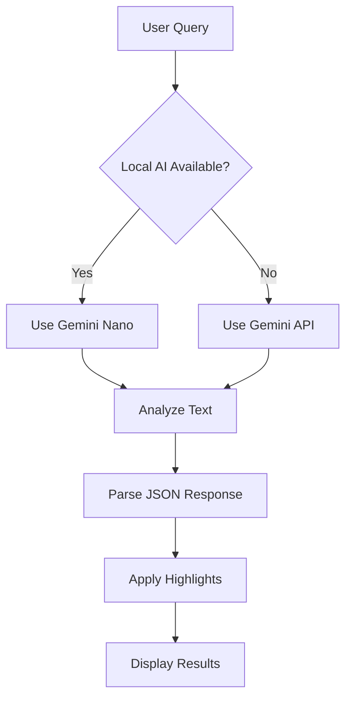

🎯 AI Highlighter Pro - Chrome Extension

<div align="center">https://img.shields.io/badge/Chrome_AI_Challenge-2025-blue?style=for-the-badge&logo=google-chrome&logoColor=white
https://img.shields.io/badge/version-1.0.0-green?style=for-the-badge
https://img.shields.io/badge/license-MIT-blue?style=for-the-badge

Intelligent Text Analysis & Highlighting with Hybrid AI Technology

Features • Installation • Usage • API Setup • Demo

</div>🌟 Overview

AI Highlighter Pro is a cutting-edge Chrome extension designed for the Google Chrome Built-in AI Challenge 2025 that leverages hybrid AI technology to intelligently analyze and highlight text on web pages. It seamlessly combines Chrome's built-in Gemini Nano AI with cloud-based Gemini API fallback to provide powerful text analysis capabilities.

🏆 Built for Chrome AI Challenge 2025

· Best Hybrid AI Application category
· Leverages Chrome's experimental AI APIs
· Seamless local + cloud AI integration

https://via.placeholder.com/800x400/4285f4/ffffff?text=AI+Highlighter+Pro+Demo

✨ Features

🤖 Hybrid AI Architecture

· Local AI First: Uses Chrome's built-in Gemini Nano when available
· Cloud Fallback: Automatically switches to Gemini API when local AI is unavailable
· Smart Model Selection: Tries multiple Gemini models for maximum compatibility

🎨 Intelligent Highlighting

· Color-Coded Categories: Different colors for goals, definitions, key points, risks, and dates
· Hover Tooltips: See category explanations by hovering over highlighted text
· Context-Aware Analysis: AI understands your query context and finds relevant content

🎯 User Experience

· Responsive Side Panel: Adapts to different screen sizes
· Dark/Light Mode: Automatic theme switching with manual override
· Real-time Feedback: Progress indicators and detailed status updates
· One-Click Clearing: Remove all highlights instantly

🔧 Advanced Capabilities

· Multi-language Support: Works across different languages and websites
· Smart Text Extraction: Filters out irrelevant content (ads, scripts, navigation)
· Error Resilience: Comprehensive error handling with helpful messages
· Privacy Focused: Your API key stays local, no data sent to third parties

🚀 Installation

Method 1: Chrome Web Store (Coming Soon)

```bash
# Will be available on Chrome Web Store after review
```

Method 2: Manual Installation

1. Download the Extension
   ```bash
   git clone https://github.com/your-username/ai-highlighter-pro.git
   ```
2. Load in Chrome
   · Open Chrome and navigate to chrome://extensions/
   · Enable "Developer mode" (toggle in top-right)
   · Click "Load unpacked"
   · Select the extension folder
3. Verify Installation
   · Look for the AI Highlighter icon in your toolbar
   · Click the icon to open the side panel

🔑 API Setup

Getting Your Free API Key

1. Visit Google AI Studio
2. Sign in with your Google account
3. Click "Create API Key" in the left sidebar
4. Copy your generated API key

Configuring the Extension

1. Open the AI Highlighter side panel
2. Paste your API key in the "Gemini API Key" field
3. The key is saved automatically for future use

🔒 Privacy Note: Your API key is stored locally in Chrome's storage and never sent to any server except Google's official Gemini API.

📖 Usage

Basic Text Analysis

1. Navigate to any webpage with text content
2. Open the AI Highlighter side panel
3. Enter what you want to analyze:
   ```
   goals, definitions, key points, risks, dates
   ```
4. Click "Analyze & Highlight"

Advanced Queries

The AI understands natural language. Try these examples:

Query Type Example Best For
Academic theories, hypotheses, conclusions Research papers
Business objectives, metrics, timelines Reports & docs
Technical algorithms, parameters, results Documentation
Creative character traits, plot points, themes Literature

Color Legend

· 🟠 Orange: Goals & Objectives
· 🟢 Green: Definitions & Concepts
· 🔵 Blue: Key Points & Main Ideas
· 🎀 Pink: Risks & Challenges
· 🟣 Purple: Dates & Timelines
· 🟡 Yellow: Other Categories

🛠️ Troubleshooting

Common Issues & Solutions

🔴 API Errors

Problem: "API model not found" or "Invalid API key"
Solution:

```javascript
// The extension automatically tries these models:
1. gemini-1.5-flash  ✅ Recommended
2. gemini-2.0-flash-exp
3. gemini-1.5-pro
4. gemini-1.0-pro
```

Steps:

1. Verify your API key at Google AI Studio
2. Ensure you have quota available
3. Check your internet connection

🔴 No Highlights Appear

Possible Causes:

· Page has limited text content
· Text is inside complex JavaScript elements
· AI didn't find matching content for your query

Solutions:

· Try a different, more specific query
· Refresh the page and try again
· Check if the page has sufficient text content

🔴 Extension Not Loading

Solutions:

1. Reload the extension in chrome://extensions/
2. Restart Chrome
3. Check for conflicting extensions

Error Messages Reference

Error Message Cause Solution
Local AI not available Chrome AI APIs not enabled Use cloud API with valid key
No sufficient text content Page has little readable text Try a different webpage
API quota exceeded Reached API usage limits Wait or check quota in AI Studio
Network error Internet connection issue Check connection and retry

🏗️ Technical Architecture

File Structure

```
ai-highlighter-pro/
├── manifest.json          # Extension configuration
├── sidepanel.html         # Main UI interface
├── sidepanel.js           # Panel logic & user interactions
├── content.js            # Content script for page analysis
├── background.js         # Service worker & background tasks
├── styles.css            # Highlight styles & animations
└── README.md            # This file
```

AI Integration Flow



Key Technologies

· Chrome Extensions API (Manifest V3)
· Gemini Nano (Local AI via window.ai)
· Gemini API (Cloud AI fallback)
· CSS Variables (Theme management)
· Modern JavaScript (ES6+, Async/Await)

🎨 Customization

Adding New Categories

Edit the highlightColors object in content.js:

```javascript
this.highlightColors = {
  goal: '#FFA500',
  definition: '#90EE90',
  keypoint: '#87CEEB',
  risk: '#FFB6C1',
  date: '#DDA0DD',
  // Add your custom categories:
  quote: '#FFD700',
  statistic: '#00CED1',
  custom_category: '#YOUR_COLOR'
};
```

Theme Customization

Modify CSS variables in sidepanel.html:

```css
:root {
  --primary-color: #4285f4;
  --bg-color: #f8f9fa;
  --text-color: #202124;
  /* Add your custom colors */
}
```

🤝 Contributing

We welcome contributions! Here's how you can help:

1. Report Bugs: Open an issue with detailed description
2. Suggest Features: Share your ideas for improvement
3. Code Contributions: Submit pull requests
4. Documentation: Help improve this README or add tutorials

Development Setup

```bash
# Clone the repository
git clone https://github.com/your-username/ai-highlighter-pro.git

# Make your changes
# Test in Chrome via chrome://extensions/

# Submit a pull request
```

📄 License

This project is licensed under the MIT License - see the LICENSE file for details.

🙏 Acknowledgments

· Google Chrome Team for the AI Challenge opportunity
· Gemini AI for powerful language models
· Chrome Extensions Community for documentation and examples

🔮 Roadmap

Upcoming Features

· Batch Processing: Analyze multiple pages at once
· Custom Categories: User-defined highlight types
· Export Highlights: Save analysis to PDF/Markdown
· Team Collaboration: Share highlighted pages
· Advanced Filters: Fine-tune AI analysis parameters
· Keyboard Shortcuts: Quick access to common actions

Known Limitations

· Limited to ~15,000 characters per analysis (API constraints)
· Requires manual API key setup for cloud features
· Some websites with heavy JavaScript may not work optimally

---

<div align="center">Built with ❤️ for the Chrome AI Challenge 2025

Report Bug •
Request Feature •
⭐ Star on GitHub

</div>